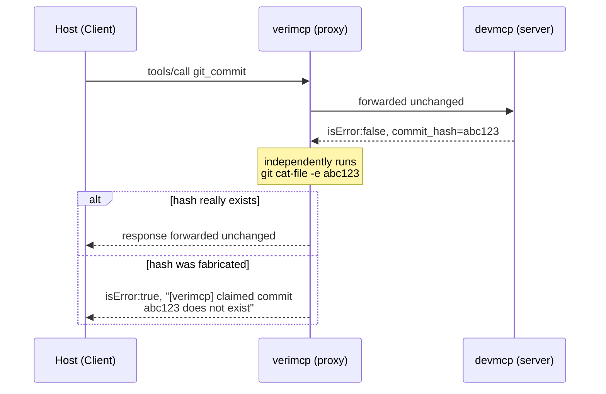
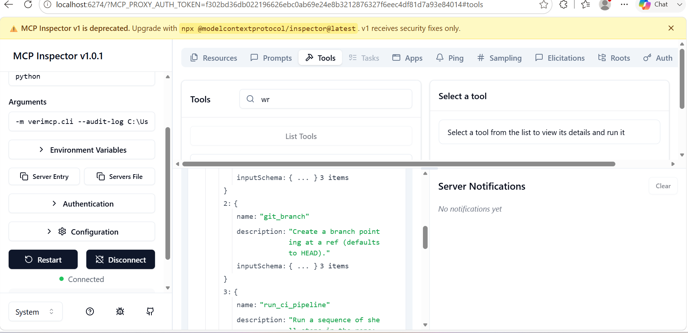
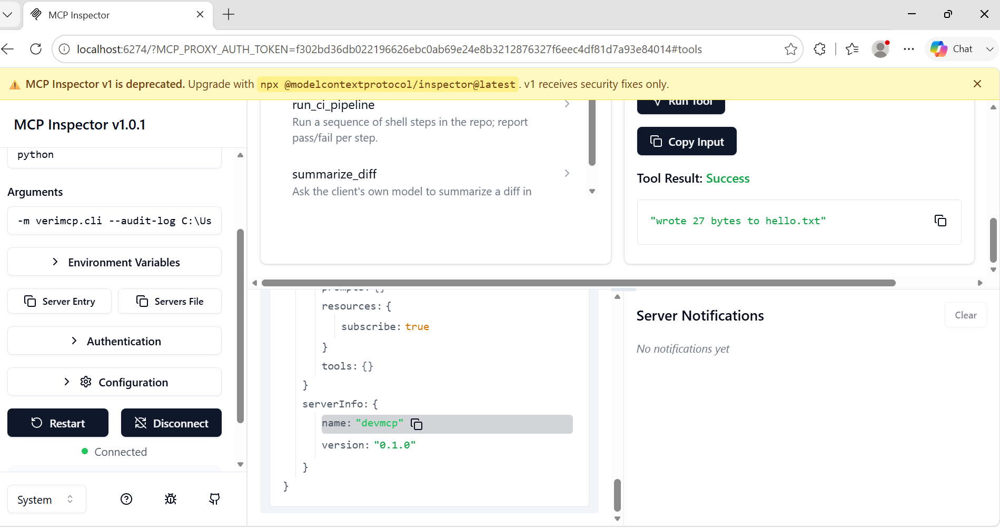
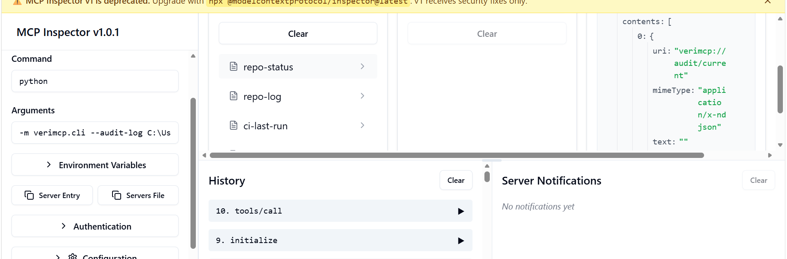

## How I found MCP

I was building agentic systems with LangGraph, wiring up graphs of LLM calls, tools, and state: the usual agent-framework plumbing. Somewhere in that work I ran into MCP: a standard way for something like Claude, or a CLI, to actually go and do stuff in another application, instead of just talking about doing it. The framing that stuck with me was "a smart API," not quite right, but close enough to make me stop and actually read the spec instead of skimming past another acronym.

## What MCP actually is

The first time I looked at MCP, the pitch sounded simple: it's a protocol that lets an AI application call tools. Simple, until you actually trace a request through it, and there are more moving parts than "AI calls tool."

There are three roles, not two. The **Host** is the actual application: Claude Code, an IDE, whatever app the user is sitting in front of. The Host owns the LLM. Inside the Host lives a **Client**, and the Client's whole job is managing one connection to one **Server**, in my case a small server I built called devmcp.

The conversation looks like this: the user asks the Host something. The Host's LLM decides it needs a tool, so the Client sends a `tools/call` request to the Server, written in a message format called JSON-RPC: think of it as a plain, structured way of saying "call this function, here are the arguments, and here's an ID so you know which reply belongs to which request." The Server does the work and sends back a response tagged with that same ID.

That ID-matching detail sounds like plumbing, not something worth mentioning, until it's the exact thing that breaks. It happened to me. MCP Inspector, the official test client, sent verimcp a `resources/list` request with id `1`. Completely unrelated to that, devmcp, running behind verimcp, had *also* just used id `1`, for its own request back to the Host (asking which folder it's allowed to touch). Two separate counters, on two separate sides of the connection, both innocently starting from 1, colliding by pure coincidence. verimcp was matching replies to requests by id alone, so for one message it mistook devmcp's own outgoing request for the reply Inspector was actually waiting for, and handed back a synthesized, mostly-empty answer instead of the real one.

My own test suite, 100+ tests at that point, never once caught this, because every test I'd written happened to answer things in an order that closed the exact timing window where the collision could occur. I wasn't being sloppy; I just couldn't see the gap from inside my own assumptions. Inspector, a real client written by people who'd never seen my code, did something perfectly ordinary and walked straight into it. That's the whole reason "tested against real, independent clients" ended up mattering more to this project than any number of tests I wrote myself.

The direction isn't always Host-to-Server, either. A Server can turn around and call the Host back: two specific cases. **Sampling**, where the Server asks the Host's own LLM to generate something on its behalf, and **elicitation**, where the Server asks the Host to go get a real human's confirmation before doing something. Both are just more JSON-RPC messages, flowing the opposite direction over the same connection.

All of that is real, working, standardized. What isn't standardized, what nothing in the protocol guarantees, is the one thing that actually matters: when a tool call comes back saying `isError: false`, that only means the Server didn't crash. It says nothing about whether the thing it claims to have done actually happened.

## The gap nobody was checking

That's easy to skim past, so slow down for a second. An agent asks a Server to commit some code. The Server replies `isError: false`, "committed abc123: fix the bug." The agent believes it. It moves on, maybe tells the user the fix is in, maybe kicks off a deploy.

Nothing in that exchange proves a commit with hash `abc123` exists anywhere. The Server could be buggy. It could be lying, deliberately, or because it fabricated a plausible-looking hash after a silent failure. The agent has no way to tell the difference between "this genuinely happened" and "this is a well-formatted sentence claiming it happened." And once the agent believes it, that belief propagates into the next decision, the next tool call, the thing it tells the user.

That's the actual gap. Not "MCP is insecure," MCP is doing exactly what it's designed to do. It's that *nothing in the loop independently checks a claim against reality*. So I built something that does.

## What I built: devmcp and verimcp

Two pieces, two jobs.

**devmcp** is a real MCP Server: the thing that actually does work. Write a file, make a git commit, create a branch, run a CI pipeline, build a Docker image, insert a row into SQLite. Nine tools now, each one a real, unmocked side effect: it really writes the file, really shells out to git, really talks to a real database file.

**verimcp** is the part that doesn't trust devmcp's word for it. It's a proxy: it sits on the wire between the Client and devmcp, invisible to both sides. Every `tools/call` response that passes through it gets checked, if there's a verifier for that tool: verimcp independently goes and looks. Did the file on disk actually get that content? Does `git cat-file` actually confirm that commit hash exists? Does `docker inspect` actually show that container with that exit code? Only if the independent check agrees with the claim does the response go through unchanged. If it doesn't agree, verimcp rewrites the response into a real, visible failure. The Client never sees the unverified claim as if it were true.



Neither side knows verimcp is there. The Host thinks it's talking straight to devmcp. devmcp thinks it's talking straight to the Host. That's deliberate: it's what makes this work as a drop-in layer in front of *any* MCP server, not just the one I wrote.

## How verification actually works, concretely

Talk about "verification" too long in the abstract and it starts to sound like hand-waving. So here's the first, simplest verifier, in full: `FilesystemVerifier`, roughly 30 lines, checking `write_file`:

```python
class FilesystemVerifier(Verifier):
    def applies_to(self, tool_name: str) -> bool:
        return tool_name in {"write_file"}

    def verify(self, request, response, root=None):
        result = response.get("result", {})
        if result.get("isError"):
            return response  # already a reported failure, nothing to add

        args = request.get("params", {}).get("arguments", {})
        path, expected_content = args.get("path"), args.get("content")
        actual_path = Path(root) / path

        if not actual_path.exists():
            return self._override(response, f"claimed write to {path!r} succeeded, but the file does not exist")

        actual_content = actual_path.read_text()
        if _sha256(actual_content) != _sha256(expected_content):
            return self._override(response, f"claimed write to {path!r} succeeded, but on-disk content does not match")

        return response  # verified: the claim matches reality
```

No LLM call. No heuristics. It re-opens the file, hashes what's actually there, compares it against what was claimed, and only lets the response through if reality agrees. Every other verifier follows the same shape against a different ground truth: `GitCommitVerifier` runs `git cat-file -e <hash>`, git's own "does this object exist" check. `DockerVerifier` runs `docker inspect` and compares the real exit code against the claimed one. `SQLiteVerifier` reconnects to the database file fresh and re-queries for the exact row. Nine tools now, across five domains (filesystem, git, CI, SQLite, Docker), each with its own independently-derived ground truth.

## Proof, not claims

Every claim above is backed by something that runs, not something I'm asserting. Three separate, independently-built AI clients, ones I didn't write, were pointed at this proxy, and each one caught a real bug in it before I trusted the "it works" story:

- **MCP Inspector** (the official testing client) caught a JSON-RPC id-collision bug: the proxy briefly confused a backend's own self-originated request with a reply meant for the Host, because two completely independent id counters happened to collide.
- **VS Code's native MCP support** caught a path-traversal bug: an absolute Windows path silently got its drive letter stripped and nested under the wrong directory instead of being rejected.
- Manually testing through Inspector myself (screenshots below, unedited) caught a third one, live: passing a Windows path with backslashes into Inspector's argument box silently ate the backslashes, and devmcp wrote into a mangled folder path *inside the real project repo* instead of the isolated test directory I intended. I only caught it because I checked real `git status` myself instead of trusting the tool's own success message, which is, appropriately, the entire thesis of this project happening to me while building it.





And beyond "does it catch bugs," there's a real, quantified answer to "how well does it catch bugs," adapted from a real paper ([arXiv 2608.02645](https://arxiv.org/abs/2608.02645)) about agents duplicating actions on retry:

| Scenario | Without verimcp | With verimcp |
|---|---|---|
| Believes a fabricated tool-call result | 12/12 (100%) | 9/12 (**75%**) |
| Duplicates a side effect on retry | 5/5 (100%) | 0/5 (**0%**) |

The 75%, not 100%, is on purpose and stated plainly in the benchmark script's own output: 3 of the 12 fabrication cases exploit a real, principled limit (a hash-exists check can't prove *this specific call* created the hash versus it already existing). A tool that claims a perfect score on its own benchmark is the thing to be suspicious of. This one doesn't.

## What's actually shipped

Both packages are published and installable (`pip install verimcp devmcp-server`) and listed on the official MCP Registry, not just sitting in a repo. Nine tools across five verified domains. 168 passing tests, all against real subprocesses and real files, nothing mocked. Every non-obvious decision along the way has a written ADR explaining why, including the mistakes.

That last part matters more to me than it might seem to say out loud: this wasn't "prompt an LLM, ship whatever it says works." Every claim in this post (the bug counts, the benchmark numbers, the screenshots) is something you can go run yourself, right now, against the real repo.

If you're working on agent reliability, MCP tooling, or just want to talk about any of this, [reach out](https://rudranaresh0201.github.io/portfolio/).
